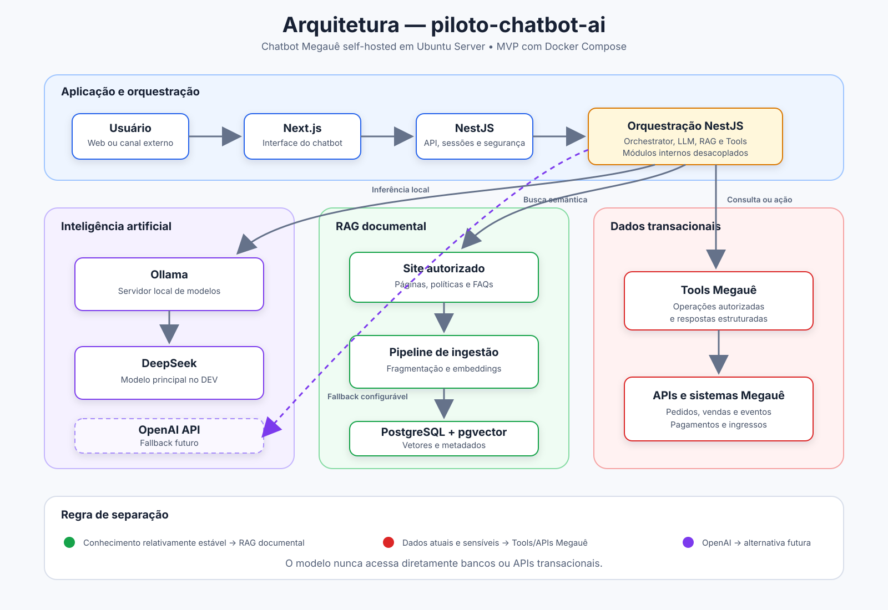

# PROJECT_CONTEXT — piloto-chatbot-ai

## Visão geral

O `piloto-chatbot-ai` é um chatbot self-hosted da Megauê, executado inicialmente em um servidor Ubuntu Server. O objetivo do MVP é validar uma arquitetura modular em que a interface web, a API da aplicação, a orquestração de IA, o modelo local, a recuperação documental e as integrações com sistemas da Megauê permaneçam claramente separadas.

## Arquitetura de alto nível

```text
Usuário
  |
  v
Next.js
  |
  v
NestJS
  |
  v
OpenClaw
  |-- LLM local: Ollama + DeepSeek
  |-- RAG documental: PostgreSQL + pgvector
  `-- Tools/APIs: sistemas e dados transacionais da Megauê
```

### Diagrama da arquitetura



No ambiente de desenvolvimento, a inferência deve usar o DeepSeek executado localmente pelo Ollama. A arquitetura deve permitir, futuramente, o uso da API da OpenAI como provedor alternativo ou fallback, sem acoplar a aplicação a um único modelo.

O MVP será implantado com Docker Compose. Kubernetes e K3s estão fora do escopo inicial e só deverão ser considerados caso necessidades reais de escala, alta disponibilidade ou operação justifiquem a complexidade adicional.

## Responsabilidades dos componentes

### Next.js

- Fornecer a interface do chatbot para o usuário.
- Capturar mensagens e exibir respostas, estados de carregamento e erros.
- Manter apenas o estado de apresentação necessário.
- Consumir a API do NestJS; não acessar diretamente OpenClaw, Ollama, banco de dados ou APIs internas da Megauê.

### NestJS

- Ser a API de entrada e a camada de aplicação do chatbot.
- Autenticar e autorizar usuários quando esse requisito for introduzido.
- Validar requisições, administrar sessões e conversas e aplicar regras de negócio da aplicação.
- Encaminhar solicitações ao OpenClaw e normalizar as respostas para o Next.js.
- Centralizar observabilidade, tratamento de erros, limites de uso e auditoria das chamadas.
- Evitar incorporar lógica específica de modelo ou executar consultas transacionais diretamente quando essas operações pertencerem a Tools bem definidas.

### OpenClaw

- Orquestrar o fluxo de IA e decidir quando responder diretamente, consultar documentos ou executar uma Tool.
- Construir prompts e fornecer ao modelo apenas o contexto necessário.
- Integrar-se ao Ollama no ambiente local.
- Consultar o mecanismo de RAG documental.
- Selecionar e executar Tools/APIs autorizadas da Megauê.
- Manter as decisões de orquestração desacopladas da interface e da API pública da aplicação.

### Ollama

- Servir modelos de linguagem localmente.
- Disponibilizar uma interface de inferência consumida pelo OpenClaw.
- Permitir troca e avaliação de modelos sem alterar Next.js ou NestJS.

### DeepSeek

- Ser o modelo de linguagem principal no ambiente de desenvolvimento.
- Interpretar solicitações, elaborar respostas e apoiar a decisão de uso do contexto e das Tools, sob a orquestração do OpenClaw.
- Não acessar diretamente bancos, documentos ou APIs da Megauê.

### PostgreSQL + pgvector

- Armazenar documentos processados, fragmentos, metadados e embeddings usados pelo RAG.
- Executar busca vetorial e filtros por metadados.
- Preservar a rastreabilidade entre cada fragmento e sua fonte documental.
- Poder armazenar dados operacionais próprios do chatbot em tabelas separadas, sem transformar cópias de dados transacionais da Megauê em fonte de verdade.

### Pipeline de ingestão

- Receber fontes documentais autorizadas.
- Extrair e limpar texto, dividir o conteúdo em fragmentos e gerar embeddings.
- Registrar metadados, versão, origem e permissões do conteúdo.
- Atualizar ou invalidar documentos de forma controlada e idempotente.

### Tools/APIs da Megauê

- Consultar ou executar operações nos sistemas transacionais oficiais.
- Aplicar autenticação, autorização, validação e auditoria por operação.
- Expor contratos claros e respostas estruturadas ao OpenClaw.
- Manter os sistemas da Megauê como fonte de verdade para informações dinâmicas, como pedidos, pagamentos, ingressos, eventos, clientes e saldos.

## Separação entre RAG documental e dados transacionais

O RAG deve ser usado para conhecimento documental relativamente estável e adequado à busca semântica, como manuais, políticas, procedimentos, perguntas frequentes e documentação de produtos.

Dados transacionais, mutáveis ou sensíveis devem ser obtidos em tempo real pelas Tools/APIs da Megauê. Não devem ser respondidos a partir de embeddings ou de cópias potencialmente desatualizadas no índice vetorial.

Regras práticas:

- “Como funciona a política de reembolso?” → consultar o RAG documental.
- “Qual é o status do pedido 123?” → chamar a API de pedidos por meio de uma Tool.
- “Quais documentos são necessários para cadastrar um evento?” → consultar o RAG documental.
- “Quantos ingressos foram vendidos hoje no evento X?” → chamar a API transacional de vendas.
- “Explique a regra e verifique se ela se aplica ao meu pedido” → recuperar a regra no RAG e consultar o pedido por Tool, mantendo as fontes separadas na composição da resposta.

O modelo não deve inventar valores transacionais quando uma Tool falhar ou não estiver disponível. Nessa situação, deve informar que não foi possível consultar o dado atual e orientar uma nova tentativa ou encaminhamento.

## Roteamento esperado

### Pergunta geral

```text
Usuário -> Next.js -> NestJS -> OpenClaw -> DeepSeek/Ollama -> resposta
```

### Pergunta documental

```text
Usuário -> Next.js -> NestJS -> OpenClaw
OpenClaw -> PostgreSQL/pgvector -> fragmentos relevantes
OpenClaw -> DeepSeek/Ollama com contexto -> resposta com referência à fonte
```

### Consulta transacional

```text
Usuário -> Next.js -> NestJS -> OpenClaw
OpenClaw -> Tool autorizada -> API Megauê -> dado atual
OpenClaw -> DeepSeek/Ollama para compor a resposta -> usuário
```

### Provedor alternativo futuro

```text
OpenClaw -> Ollama/DeepSeek (principal no DEV)
         `-> OpenAI API (possível alternativa ou fallback futuro)
```

A adoção da OpenAI API e as condições de fallback deverão ser configuráveis. Antes do uso em produção, deverão ser definidos critérios de privacidade, custo, timeout, repetição, registro de falhas e quais dados podem ser enviados a um provedor externo.

## Ordem de implementação do MVP

1. Preparar e validar o ambiente Ubuntu Server.
2. Instalar e validar o OpenClaw.
3. Instalar e validar o Ollama.
4. Baixar e validar o modelo DeepSeek adequado aos recursos do servidor.
5. Integrar OpenClaw e Ollama.
6. Executar um teste local de ponta a ponta da inferência, antes de adicionar as demais camadas.
7. Criar a API NestJS e integrá-la ao OpenClaw.
8. Criar a interface Next.js e integrá-la ao NestJS.
9. Provisionar PostgreSQL com pgvector.
10. Implementar o pipeline de ingestão documental.
11. Implementar e avaliar o fluxo de RAG.
12. Implementar as Tools e integrações com APIs da Megauê.
13. Adicionar canais externos, como WhatsApp ou outros, somente após estabilizar o fluxo web e os controles de segurança.

Cada etapa deve ter um teste mínimo e critérios de aceite antes do avanço para a próxima. A composição final dos serviços deve ser declarada no Docker Compose, com configurações e segredos fornecidos por variáveis de ambiente e sem credenciais versionadas.

## Diretriz obrigatória para o Codex

Antes de instalar, atualizar, remover ou configurar qualquer software, o Codex deve primeiro avaliar o ambiente atual de forma não destrutiva. Essa avaliação deve incluir, quando aplicável:

- sistema operacional, versão e arquitetura;
- CPU, memória, armazenamento disponível e presença de GPU;
- ferramentas e serviços já instalados;
- versões de Docker e Docker Compose;
- portas ocupadas e serviços em execução relevantes;
- arquivos existentes do projeto, configurações, alterações locais e documentação;
- restrições de rede, permissões e variáveis necessárias, sem expor segredos.

Depois da avaliação, o Codex deve reportar claramente:

1. o estado atual encontrado;
2. eventuais riscos, incompatibilidades ou informações ausentes;
3. o próximo passo recomendado e o resultado esperado.

Somente depois desse relatório o Codex poderá iniciar uma instalação ou alteração, respeitando as autorizações do usuário e pedindo confirmação quando a ação for destrutiva, elevar privilégios, alterar rede/firewall, afetar serviços existentes ou tiver impacto operacional relevante.

## Princípios do MVP

- Começar simples, observável e reproduzível.
- Manter as camadas desacopladas e os contratos explícitos.
- Usar o modelo local como padrão no desenvolvimento.
- Não misturar conhecimento documental com a fonte de verdade transacional.
- Aplicar privilégio mínimo às Tools e nunca expor credenciais ao modelo ou ao cliente.
- Registrar decisões de roteamento e chamadas de Tools sem armazenar conteúdo sensível além do necessário.
- Avaliar qualidade do RAG com perguntas e respostas esperadas antes de expandir o escopo.
- Adiar Kubernetes/K3s e canais externos até o núcleo do MVP estar validado.
